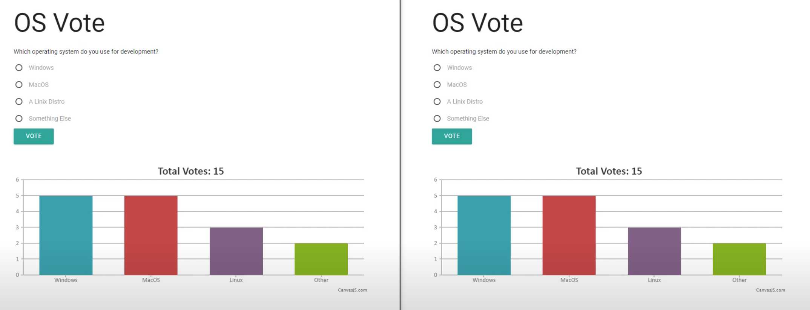

# Ödev 3

Bu ödevde gerçek zamanlı çalışan bir oylama uygulaması geliştirmeniz gerekiyor.

## Gereksinimler

- [ ] Ekranda bir tane soru olmalı ve web sayfasına girenler oylama yapabilmeli.
- [ ] Verilen oylar gerçek zamanlı olarak bağlı olan diğer kullanıcılara da gösterilmelidir.
- [ ] Sayfa yenilendikten sonra herhangi veri kaybı olmamalıdır.
- [ ] Oylama sonuç durumu grafiksel ve yüzdesel olarak gösterilmelidir.
- [ ] Uygulama Netlify üzerine deploy edilmeli ve uygulamanın demo URL'i README dosyasının en üstünde belirtilmelidir.

[Demo Uygulama](https://www.youtube.com/watch?v=M0s6DLpcSn0)

> Tasarımı dilediğiniz gibi yapabilirsiniz.

Son teslim tarihi: 11.10.2021 - 10:00

Kolaylıklar :)